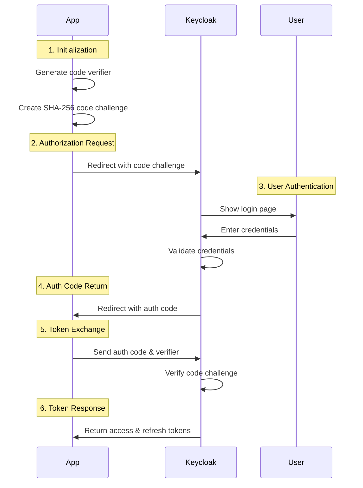

# Authentication Basics in the Sports Community Management App

This article explains the authentication and authorization mechanisms used in the Sports Community Management App, focusing on the OAuth 2.0 and OpenID Connect protocols implemented through Keycloak.

## Table of Contents

1. [Introduction](#introduction)
2. [Central Identity Provider Setup](#central-identity-provider-setup)
3. [Frontend Authentication with PKCE Flow](#frontend-authentication-with-pkce-flow)
4. [Understanding Auth Codes and Access Tokens](#understanding-auth-codes-and-access-tokens)
5. [Backend API Role and Token Validation](#backend-api-role-and-token-validation)
6. [Security Considerations](#security-considerations)

## Introduction

Modern web applications require robust authentication and authorization mechanisms to protect user data and ensure secure access to resources. The Sports Community Management App implements industry-standard protocols through Keycloak, a popular open-source Identity and Access Management solution.

## Central Identity Provider Setup

### What is a Central Identity Provider?

A central identity provider (IdP) is a service that stores and manages user identities and provides authentication services to multiple applications. Using a central IdP offers several advantages:

- **Single Sign-On (SSO)**: Users can authenticate once and access multiple applications without re-entering credentials
- **Centralized User Management**: User accounts, roles, and permissions are managed in one place
- **Enhanced Security**: Authentication logic is handled by specialized security software
- **Standardized Protocols**: Implementation of industry-standard protocols like OAuth 2.0 and OpenID Connect

### Keycloak as Our Identity Provider

In this project, Keycloak serves as our central identity provider. Keycloak is configured with:

1. **Realm**: A realm is a domain of user identities. Our application uses a dedicated realm for all sports organizations.
2. **Clients**: Each component that needs to authenticate users has a client configuration:
   - **Frontend Client**: A public client using PKCE flow
   - **Backend Client**: A confidential client for service-to-service communication
3. **Roles**: Predefined roles (System Admin, Organization Maintainer, Organization User) that determine what actions users can perform
4. **Users**: End-users with assigned roles and organization affiliations

## Frontend Authentication with PKCE Flow

### What is PKCE?

PKCE (Proof Key for Code Exchange) is an extension to the OAuth 2.0 authorization code flow, designed to prevent authorization code interception attacks for public clients (like browser-based applications).

### Why PKCE for Frontend Applications?

Frontend applications running in browsers cannot securely store client secrets. The PKCE flow addresses this security challenge by:

1. Creating a cryptographically random code verifier
2. Generating a code challenge derived from the verifier
3. Using the challenge during authorization request
4. Presenting the original verifier during token exchange

This ensures that only the legitimate application that initiated the authentication flow can exchange the authorization code for tokens.

### PKCE Flow Implementation

Our frontend implements the PKCE flow as follows:

## Understanding Auth Codes and Access Tokens

### Authorization Code

An authorization code is a temporary code issued by the authorization server (Keycloak) after successful authentication. Key characteristics:

- Short-lived (typically valid for seconds to minutes)
- Single-use (can only be exchanged for tokens once)
- Transmitted via browser redirect (front-channel)
- Not useful by itself - must be exchanged for tokens

### Access Token

An access token is a credential used to access protected resources. In our application:

- Formatted as a JWT (JSON Web Token)
- Contains claims about the authenticated user (identity, roles, permissions)
- Digitally signed by Keycloak to prevent tampering
- Has a limited lifetime (typically 5-15 minutes)
- Presented to the backend API to access protected resources

### Refresh Token

A refresh token allows obtaining a new access token when the current one expires:

- Longer lifetime than access tokens (hours, days, or weeks)
- Stored securely by the client application
- Can be revoked by the authorization server if needed

## Backend API Role and Token Validation

### Backend API as a Resource Server

The backend API in our application serves as a resource server that:

1. Provides access to protected resources (sports events data)
2. Validates access tokens presented by clients
3. Enforces authorization based on token claims

### Token Validation Process

When the backend receives a request with an access token:

1. **Signature Verification**: Verifies the token's digital signature using Keycloak's public key
2. **Expiration Check**: Ensures the token hasn't expired
3. **Claims Extraction**: Extracts user identity, roles, and permissions from the token
4. **Authorization Decision**: Determines if the user has sufficient permissions for the requested operation

### Backend as a Client

The backend also acts as a client to Keycloak when it needs to:

- Validate tokens using Keycloak's introspection endpoint
- Obtain service account tokens for system operations
- Communicate with Keycloak's admin API

As a confidential client, the backend can securely store and use a client secret for these operations.

## Security Considerations

### Token Storage

- **Access Tokens**: Stored in memory (not in localStorage or cookies) to prevent XSS attacks
- **Refresh Tokens**: Stored in secure, HttpOnly cookies to prevent JavaScript access

### Token Transmission

- Always transmitted over HTTPS to prevent interception
- Access tokens sent as Bearer tokens in the Authorization header

### Additional Protections

- **CORS Configuration**: Restricts which domains can make requests to the API
- **CSP Headers**: Limits which resources can be loaded by the frontend
- **Short Token Lifetimes**: Minimizes the impact of token leakage
- **Token Revocation**: Ability to invalidate tokens if a security breach is suspected

## Conclusion

The authentication system in the Sports Community Management App follows industry best practices by implementing OAuth 2.0 and OpenID Connect protocols through Keycloak. This approach provides a secure, scalable, and user-friendly authentication experience while maintaining strong protection for user data and application resources.

By separating authentication concerns from the core application logic, we achieve better security, maintainability, and flexibility in our system architecture.
